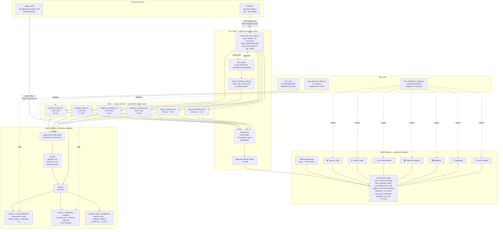

# Solution Architecture

## Overview

The Pokémon platform is a two-repo analytics ecosystem built around a shared
PokéAPI data pipeline. One repo serves kids learning about Pokémon; the other
serves adult analytics. Both read from the same set of source-of-truth CSVs,
build their own DuckDB semantic layer, and expose their data via Streamlit
web applications.

```
┌─────────────────────────────────────────────────────────────────────────────┐
│  itech88/pokemon-analytics          │   itech88/pokemon-pokedex             │
│  Adult analytical dashboard         │   Kid-friendly Visual Pokédex         │
│  7 Streamlit pages                  │   3-screen Streamlit app              │
│  12 DuckDB views + 6 raw tables     │   3 DuckDB views + 5 raw tables       │
│  51 unit tests + 8 smoke tests      │   10 Playwright E2E tests             │
└─────────────────────────────────────────────────────────────────────────────┘
                       ▲ both read from shared CSVs
```

---

## Solution Architecture Diagram



---

## Layers

### External Sources

| Source | What we use | Rate limit |
|---|---|---|
| PokéAPI `pokeapi.co/api/v2` | Pokémon stats, species, encounters, types, abilities, evolution chains | Soft limit; respected via local cache |
| GitHub Sprite CDN `raw.githubusercontent.com/PokeAPI/sprites` | Official artwork PNGs, animated battle GIFs | No limit; CDN-served |

The `.api_cache/` directory stores every API response as a JSON file keyed by endpoint
URL. Re-running the ETL scripts costs zero network calls for already-fetched data.

### ETL Layer (`pokemon-analytics` repo)

Three Python scripts produce the six source CSVs:

| Script | Input | Output | Network calls |
|---|---|---|---|
| `fetch_pokemon_data.py` | PokéAPI (cached) | 5 CSVs | 0 if cache warm; ~5,318 on cold start |
| `extract_pokedex_data.py` | `.api_cache/` only | `pokedex_data.csv` | 0 always |
| `build_db.py` | 6 CSVs | `pokemon.duckdb` | 0 |

`fetch_pokemon_data.py` is the only script that ever touches the network. It uses
`asyncio` + `aiohttp` with 30 concurrent connections and an exponential-backoff retry
strategy. The `WILD_METHODS` allowlist (35 encounter methods) ensures only genuine
wild encounters appear in `Pokemon_Locations.csv`.

### Data Layer (CSVs)

The six CSVs are committed to both repos and serve as the **single source of truth**.
They are regenerated by re-running `fetch_pokemon_data.py` + `extract_pokedex_data.py`,
then synced to the kids repo with a `cp` command.

**Why CSVs instead of a shared database?**
- Simple to version-control and diff
- Any developer can open them in Excel/Numbers to inspect data
- Each repo builds its own DuckDB from them — no shared mutable state
- CSVs can be exported to Parquet for the future DuckDB-WASM upgrade

### Application Layer

Both applications use the same stack but with different emphases:

| Aspect | Adult (`pokemon-analytics`) | Kids (`pokemon-pokedex`) |
|---|---|---|
| Framework | Streamlit 1.58 | Streamlit 1.58 |
| DB connection | `read_only=True`, `@st.cache_resource` | `read_only=True`, `@st.cache_resource` |
| Session state | Minimal (filter state per page) | Rich (`selected_gen`, `selected_number`, scroll flags) |
| Data volume per query | Aggregated views (18–1,026 rows) | Single-Pokémon lookups (1–100 rows) |
| Scroll management | Standard Streamlit | Custom JS via `st.components.v1.html` with cache-bust counter |
| Image loading | Plotly charts (no external images) | CDN sprites via `st.image()` and raw `` tags |

### Semantic Layer (DuckDB Views)

DuckDB sits between the CSVs and the UI. All business logic lives in SQL views
rather than Python, which means:
- The same views can be queried from notebooks, the dashboard, and future WASM clients
- Adding a new field means adding it to the view — the UI picks it up automatically
- Views are cheap to rebuild (sub-second for this dataset size)

**Adult repo views (12):**
`pokemon_full`, `pokemon_base`, `pokemon_full_dex`, `pokemon_with_abilities`,
`pokemon_with_locations`, `type_matchup_matrix`, `stat_summary_by_type`,
`stat_summary_by_generation`, `legendary_vs_normal`, `top_pokemon_by_stat`,
`region_encounter_summary`, `dual_type_distribution`

**Kids repo views (3):**
`pokemon_base`, `pokedex_full`, `pokemon_traits`

### Test Layer

| Test file | What it validates | When to run |
|---|---|---|
| `test_pokemon_data.py` | CSV data integrity against `.api_cache/` — types, encounter rates, no gift-only Pokémon in wild locations | After any ETL run or CSV change |
| `test_dashboard_smoke.py` | All 7 adult dashboard pages render without Python exception | Before every commit to `pokemon-analytics` |
| `test_ui.py` | Full browser automation — game selection, generation navigation, card clicks, scroll behaviour, location accuracy | Before every commit to `pokemon-pokedex` |

---

## Future Architecture: DuckDB-WASM + React

See [IDEAS.md](IDEAS.md#architecture-upgrade--duckdb-wasm--react) for the full
upgrade path. The key architectural difference: CSVs → Parquet → hosted statically →
queried in-browser by DuckDB-WASM. The Python ETL layer is unchanged; only the
presentation layer moves from Streamlit (server-rendered) to React (client-rendered).
