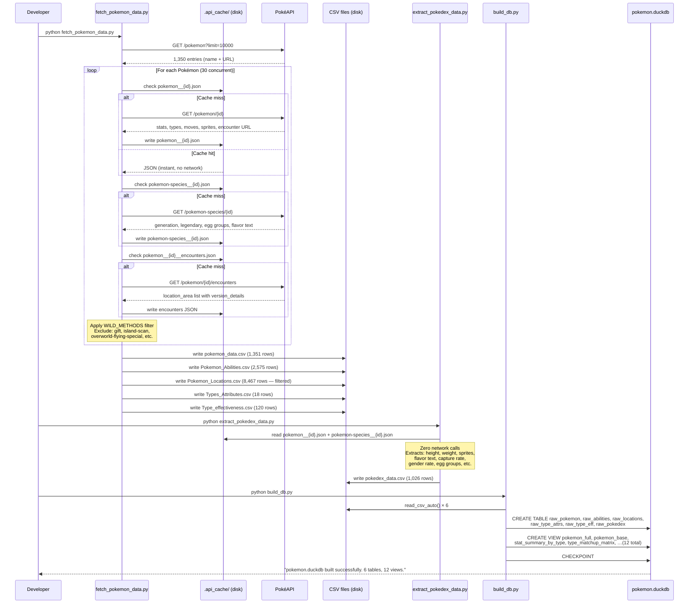
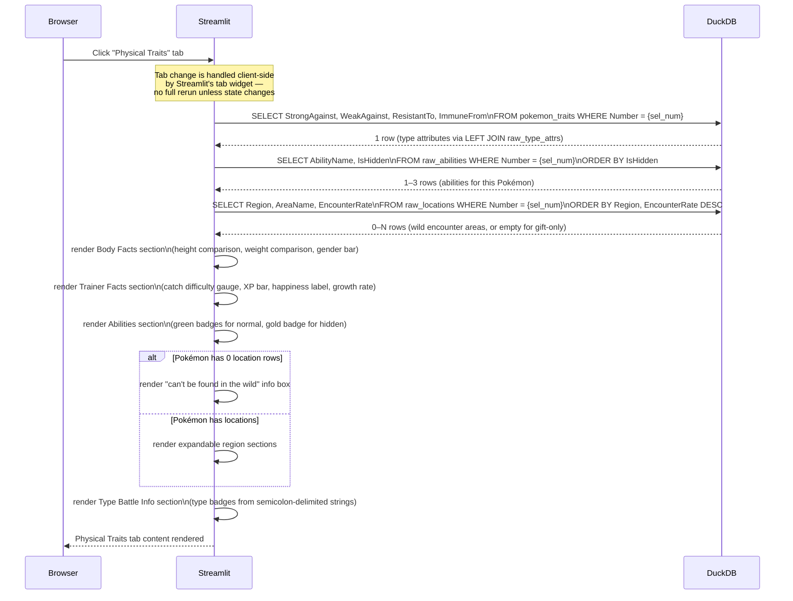

# Data Flow

## Overview

This document traces data movement at two levels:
1. **Build-time ETL flow** — from PokéAPI to committed CSVs to DuckDB
2. **Runtime user flow** — from a browser click to rendered HTML

---

## Build-Time ETL Flow

The following sequence shows what happens when you run `python fetch_pokemon_data.py`
on a cold system (no cache), then `python build_db.py`, then launch the app.



---

## Runtime User Interaction Flow (Kids App)

The following shows what happens when a user clicks a Pokémon card while scrolled
deep in the grid — the most complex interaction path in the app.

```mermaid
sequenceDiagram
  participant User as Browser (User)
  participant ST as Streamlit Server (Python)
  participant SS as Session State
  participant DB as DuckDB (in-process)
  participant CDN as Sprite CDN (GitHub)
  participant JS as Browser JS Engine

  User->>ST: Click "View →" button on Charmander card

  ST->>SS: selected_number = 4
  ST->>SS: _scroll_top = True
  ST->>ST: st.rerun() — full Python re-execution

  Note over ST: Script re-runs from top

  ST->>SS: read selected_gen (e.g., 1)
  ST->>SS: read selected_number (4 = Charmander)
  ST->>SS: pop _scroll_top → True
  ST->>SS: get _scroll_n = N; set _scroll_n = N+1

  ST->>ST: components.html("<script>/* N+1 */\nfunction _s(){...}\n_s();\nsetTimeout(_s,200);\nsetTimeout(_s,500);\n</script>", height=0)
  Note over ST: Unique comment /* N+1 */ forces<br/>new iframe — script always re-executes

  ST->>DB: SELECT * FROM pokedex_full\nWHERE Generation = 1\nORDER BY Number, Name
  DB-->>ST: 151 rows (Gen I Pokémon)

  ST->>DB: SELECT * FROM pokedex_full\nWHERE Number = 4
  DB-->>ST: 1 row (Charmander detail)

  ST->>ST: render_detail(row=Charmander, tab=Overview)
  ST->>CDN: 
  CDN-->>User: HD artwork PNG

  ST->>CDN: 
  CDN-->>User: Animated battle GIF

  ST->>ST: render card grid (151 cards, 8 per row)
  Note over ST: Card #4 (Charmander) renders with:<br/>border: accent colour<br/>button: "✓ Selected" (primary type)

  ST-->>User: Full page HTML + CSS delivered to browser

  User->>JS: Iframe loads (the scroll component)
  JS->>JS: _s() fires immediately → stMain.scrollTop = 0
  JS->>JS: setTimeout(_s, 200ms) → scrollTop = 0 (catches reflow)
  JS->>JS: setTimeout(_s, 500ms) → scrollTop = 0 (final guard)

  User->>User: Page snapped to top; Charmander detail visible
```

---

## Runtime Flow: Physical Traits Tab

When a user clicks the "🏋️ Physical Traits" tab (after a Pokémon is selected):



---

## WILD_METHODS Filter — How It Works

This filter is the fix for the Charizard location bug (June 2026). It runs during
CSV generation in `fetch_pokemon_data.py`.

```
PokéAPI encounter response structure:
[
  {
    "location_area": {"url": "…/location-area/123/"},
    "version_details": [
      {
        "max_chance": 100,
        "encounter_details": [
          {
            "chance": 100,
            "method": {"name": "overworld-flying-special"},  ← CHECK THIS FIELD
            "min_level": 3,
            "max_level": 56
          }
        ]
      }
    ]
  }
]

Filter logic:
  Keep encounter IF any(
    ed["method"]["name"] IN WILD_METHODS
    for vd in version_details
    for ed in vd["encounter_details"]
  )

WILD_METHODS includes:  walk, overworld, dark-grass, cave-spots, surf,
                        old-rod, good-rod, super-rod, horde, honey-tree,
                        sos-encounter, headbutt-*, …(35 total)

WILD_METHODS excludes:  gift, island-scan, overworld-flying-special,
                        overworld-special, snag, npc-trade, gift-egg, …
```

**Result:** Charizard's 25 Kanto "overworld-flying-special" entries → filtered out → 0 rows.
Rattata's "walk" entries → kept → 73 rows across multiple regions.

---

## Sprite URL Construction

Sprite URLs are derived deterministically from a Pokémon's `id` field — no API call needed.

```
Official HD artwork (PNG, transparent background):
  https://raw.githubusercontent.com/PokeAPI/sprites/master/sprites/
  pokemon/other/official-artwork/{id}.png

Animated battle sprite (GIF, pixel-art style):
  https://raw.githubusercontent.com/PokeAPI/sprites/master/sprites/
  pokemon/other/showdown/{id}.gif

Shiny animated sprite:
  https://raw.githubusercontent.com/PokeAPI/sprites/master/sprites/
  pokemon/other/showdown/shiny/{id}.gif
```

**Important:** The `id` here is the Pokémon's internal API identifier, which equals
the species Pokédex number for all base forms (1–1025). Regional variants and alternate
forms have IDs above 10000 and are excluded from the kids app by the `IsForm = false`
filter in `pokemon_base`.

---

## pokedex_full De-duplication — The Farfetch'd Galar Case

`pokemon_data.csv` has an edge case: "Farfetchd Galar" (number 83) appears without
parentheses in its name because the display-name formatter dropped the apostrophe
during slug normalization. This means `IsForm = false` matches two rows for species 83
instead of one.

The `load_all()` function in `app.py` applies a secondary de-duplication:

```python
df["_namelen"] = df["Name"].str.len()
df = (df.sort_values(["Number", "_namelen"])
        .drop_duplicates(subset=["Number"])   # keep shortest name = canonical
        .drop(columns=["_namelen"]))
```

This is a display-layer workaround. The correct fix is in `fetch_pokemon_data.py`'s
`_display_name()` function — ensuring Galarian forms always produce names with
parentheses. Tracked for a future cleanup pass.
